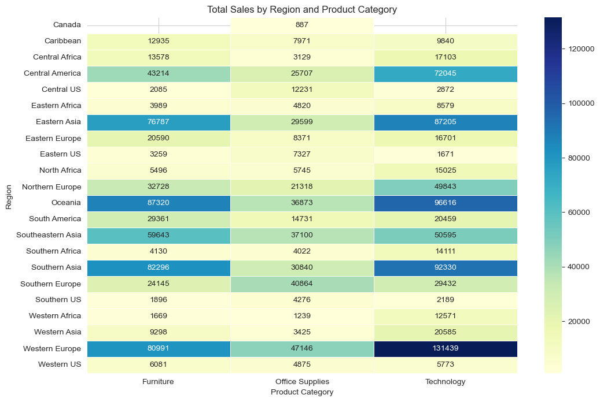
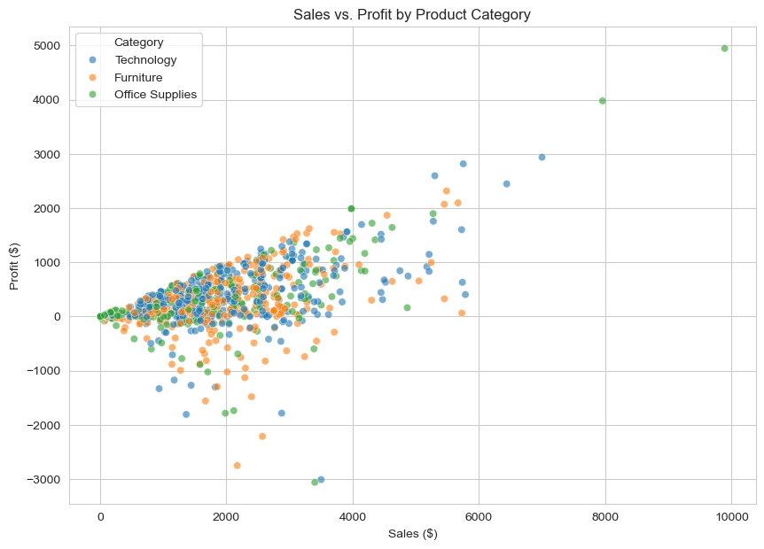
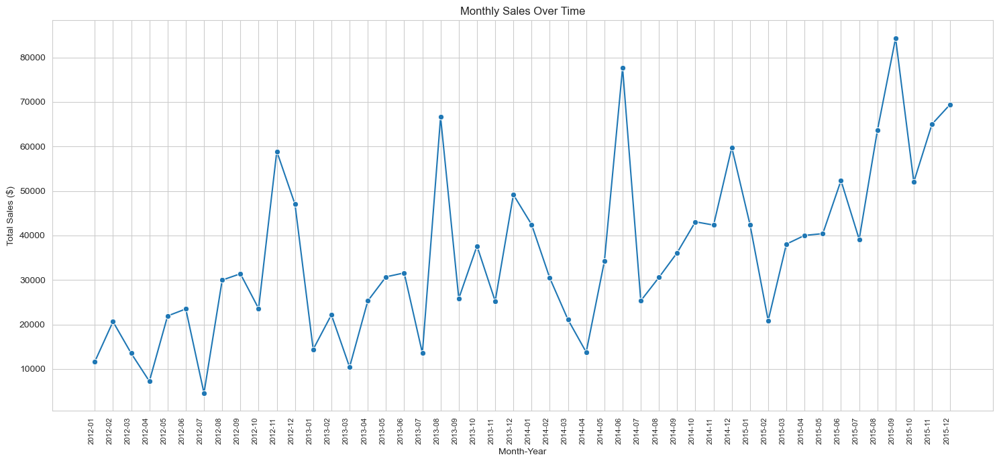
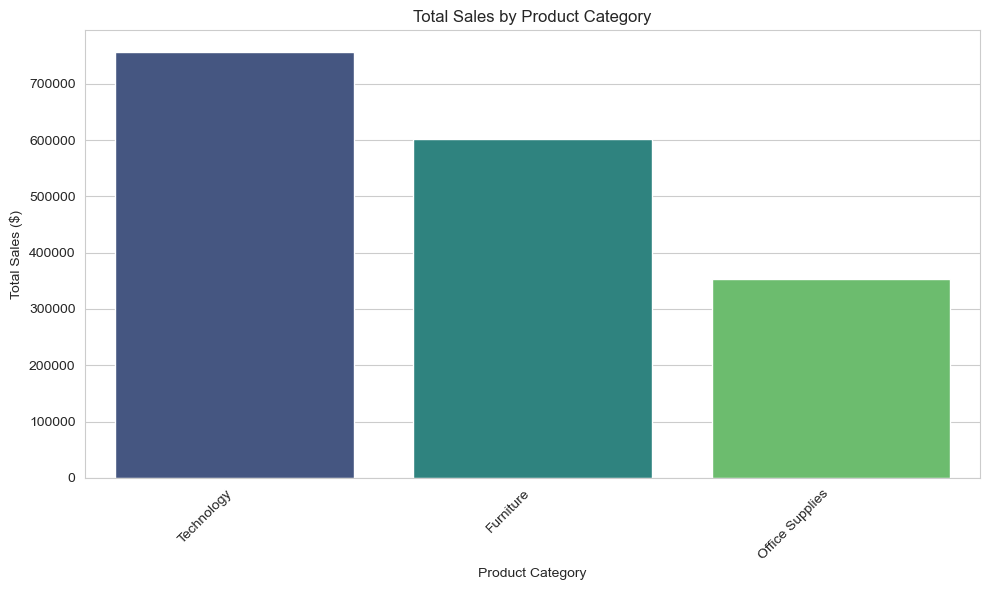

# Global Superstore Sales Analysis (Python)

## Overview

This project presents a business-focused sales performance analysis conducted in Python using the Global Superstore dataset.

The objective was to explore revenue distribution, profitability patterns, and time-based sales trends in order to identify key business drivers and structural performance differences across regions and product categories.

The analysis prioritises clarity, structured exploration, and business interpretation over purely technical complexity.

---

## Business Context

Retail and distribution businesses require regular performance monitoring to understand:

- Which regions generate the highest revenue
- Which product categories drive performance
- The relationship between sales and profitability
- Seasonal sales patterns over time

This analysis demonstrates how Python can be used to extract decision-relevant insights from transactional data.

---

## Dataset

- Source: Global Superstore dataset
- Type: Transactional retail sales data
- Includes:
  - Sales values
  - Profit values
  - Product categories
  - Regions
  - Order dates

The dataset was cleaned and prepared using Pandas before analysis.

---

## Tools & Technologies

- Python
- Pandas
- Matplotlib
- Seaborn
- Jupyter Notebook

---

## Analysis Performed

The analysis includes:

- Aggregation of total sales by region and product category
- Sales vs. profit relationship analysis
- Monthly sales trend analysis
- Total sales comparison across product categories

---

## Analysis Visualisations

### Sales by Region and Category


### Sales vs Profit


### Monthly Sales Trend


### Total Sales by Category


---

## Key Business Insights

- Technology generates the highest total revenue among product categories.
- Certain regions significantly outperform others in specific categories.
- Sales and profit are positively correlated, but outliers highlight potential discount or cost issues.
- Monthly sales show visible seasonality patterns.

---

## Repository Structure

```
global-superstore-sales-analysis-python/
│
├── screenshots/
│   ├── total_sales_by_region_and_product_category.png
│   ├── sales_vs_profit.png
│   ├── montly_sales_over_time.png
│   └── total_sales_by_product_category.png
│
├── Global_Superstore.csv
├── Global_Superstore.ipynb
└── README.md
```

---

## About This Project

This project forms part of my professional data analytics portfolio and demonstrates practical Python-based data analysis and business insight generation.
